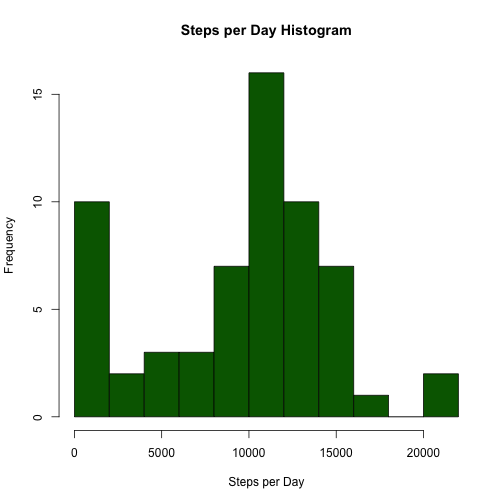
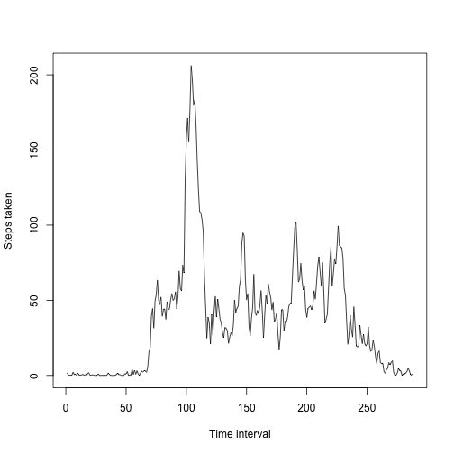
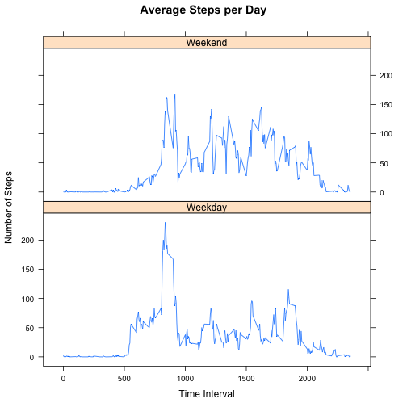

## This is the first course project from the documentation course of the coursera data-science specialization

at first, the dataset will be read into r and the date variable is converted.


```r
library(knitr)
opts_chunk$set(cache=TRUE, echo=TRUE)
activity <- read.csv("activity.csv")
activity$date <- as.Date(as.factor(activity$date))
```

next, the daily sum of steps is calculated into a new variable


```r
dailysteps <- aggregate(activity$steps,by=list(activity$date),sum, na.rm=TRUE)
colnames(dailysteps) <- c("Date","Steps per Day")
```

in the next step, a histogram of the "Steps per Day" variable is created with 15 breaks. We can see that days with around 11.000 Steps occur most often and that there are 10 days with very low step counts. This is probably due to the missing values.


```r
hist(dailysteps$"Steps per Day", col="dark green", breaks=15,main="Steps per Day Histogram", xlab="Steps per Day")
```



```r
stepmedian <- median(dailysteps$`Steps per Day`)
stepmean <- round(mean(dailysteps$`Steps per Day`),2)
```

The median of steps per day is 10395, the mean value is 9354.23.
In this step a data frame containing the means for the time intervals across the days is created.


```r
intervalsteps <- round(aggregate(activity$steps,by=
      list(activity$interval),mean, na.rm=TRUE),2)
colnames(intervalsteps) <- c("Time interval","Steps taken")
```

It's plotting time again: 


```r
plot.ts(intervalsteps$`Steps taken`, xlab="Time interval", ylab="Steps taken")
```



```r
maxinterval <- max(intervalsteps$`Steps taken`)
maxcase <- which.max(intervalsteps$`Steps taken`)
daytime <- (maxcase*5)
library(chron)
daytime <- substr(times((daytime%/%60 +  daytime%%60 /60)/24), 1, 5)
```

It appears that the most steps on average are at the time of 08:40. The average number of steps taken in this timeframe is 206.17.


```r
missvalsum <- sum(is.na(activity$steps))
```

The total number of missing values in the dataset is 2304.
In the next step, the dataset is recoded so that the missing values are replaced with the average value for that time interval.


```r
missval <- is.na(activity$steps)
meaninterval <- tapply(activity$steps, activity$interval, mean, na.rm=TRUE)
activity$steps[missval] <- meaninterval[as.character(activity$interval[missval])]
```

Plotting time again! The code performed here is exactly the same as for the first plot, the replacement of missing values with averages is the only thing that is different. We can see that days with fewer than 2000 steps are reduced very much while the number of days with around 11000 steps increased.


```r
dailysteps2 <- aggregate(activity$steps,by=list(activity$date),sum)
colnames(dailysteps2) <- c("Date","Steps per Day")

hist(dailysteps2$"Steps per Day", col="dark green", breaks=15,main="Steps per Day Histogram", xlab="Steps per Day")
```


```r
round(median(dailysteps2$`Steps per Day`),1)
```

```
## [1] 10766.2
```

```r
round(mean(dailysteps2$`Steps per Day`),1)
```

```
## [1] 10766.2
```

This time the median and the mean value for steps per day are equal.

In this step, the date is recoded into weekdays and then into a new variable that determines if it is a weekday or weekend.


```r
actweekday <- activity
actweekday$date <- weekdays(actweekday$date)
colnames(actweekday)[2] <- "Weekday"
actweekday$Daytype <- ifelse(actweekday$Weekday %in% c("Samstag", "Sonntag"), "Weekend", "Weekday")
```

finally, the data is aggregated together by the intervals and split between the two day types.


```r
aggregstepbyint <- aggregate(steps ~ interval + Daytype, actweekday, mean)
library(lattice)
xyplot(aggregstepbyint$steps ~ aggregstepbyint$interval|aggregstepbyint$Daytype, main="Average Steps per Day",xlab="Time Interval", ylab="Number of Steps", layout=c(1,2),type="l")
```



the plot shows a peak in the morning during the weekdays while on the weekend, step frequencies are distributed widely during the daytime.
